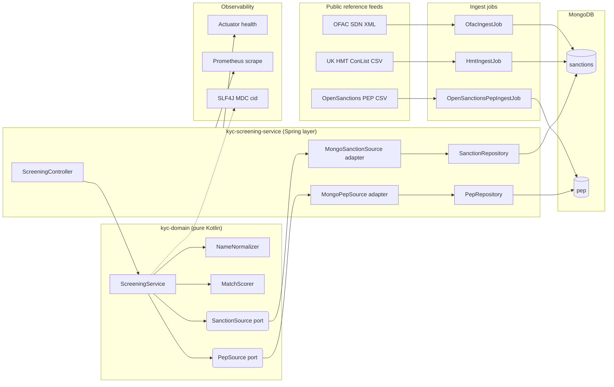
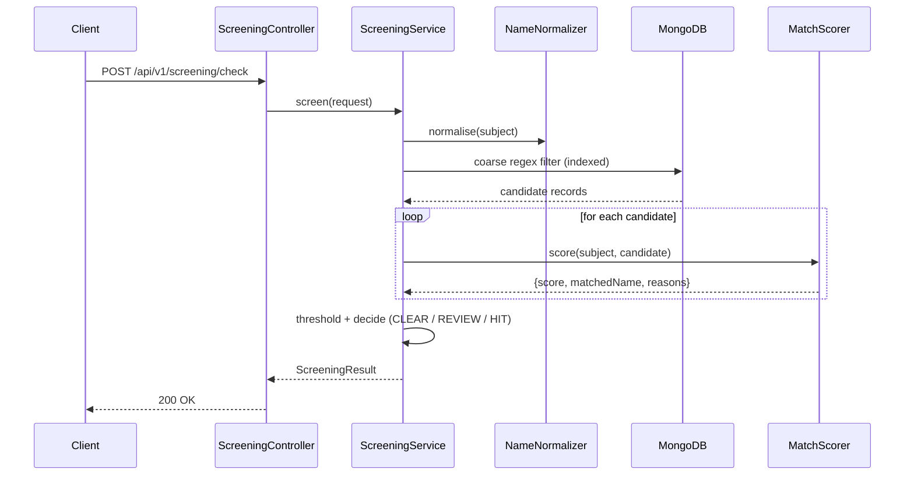

# KYC Screening Service

A Kotlin + Spring Boot 3 microservice that screens a person against public **sanctions lists** (OFAC SDN, UK HMT / OFSI Consolidated List) and **Politically Exposed Person** data (OpenSanctions). Returns an explainable score-per-match with a deterministic **CLEAR / REVIEW / HIT** decision.

> Demonstrates the pattern I use in regulated UK fintech: pluggable list ingesters, coarse index filter → Jaro-Winkler scoring with DOB and country weighting, JWT-secured REST API, structured logs with correlation IDs, Prometheus metrics, health probes. Open data only; no proprietary code.

[](https://github.com/hafiz5007/kyc-screening-service/actions/workflows/ci.yml)


## Highlights

- **Framework-free domain module** — the screening pipeline (`NameNormalizer`, `MatchScorer`, `ScreeningService`) lives in a separate Gradle sub-module (`kyc-domain`) with **zero** Spring / MongoDB / Jakarta dependencies. The compiler enforces the dependency rule: nothing in the domain can drift back into being framework-coupled.
- **Ports + adapters** — the domain defines `SanctionSource` and `PepSource` interfaces; the Spring layer implements them (`MongoSanctionSource`, `MongoPepSource`) and maps the Mongo entities to pure domain candidates.
- **Explainable scoring** — every non-zero match ships with a human-readable `reasons` list so compliance teams can justify a decision.
- **Multi-source** — one repository, many list ingesters (`OFAC`, `HMT`, `OpenSanctions PEP`) sharing a common `IngestJob` interface.
- **JWT resource server** — `spring-boot-starter-oauth2-resource-server` on every `/api/v1/**` endpoint.
- **Observable** — structured logs with per-request correlation IDs, Prometheus scrape endpoint, K8s liveness / readiness probes via Spring Boot Actuator.
- **Dockerised** — multi-stage JDK 21 build, non-root runtime, docker-compose with Mongo + app + Prometheus.
- **CI** — GitHub Actions: JDK 21, Gradle wrapper, build + test + Docker image build.

## Module layout

```
kyc-screening-service/                 root Spring Boot module (app + adapters)
├── settings.gradle.kts                includes :kyc-domain
├── build.gradle.kts                   implementation(project(":kyc-domain"))
├── src/main/kotlin/com/hafiz5007/kyc/
│   ├── KycScreeningApplication.kt
│   ├── api/                           REST controllers
│   ├── config/                        Spring config; DomainConfig exposes pure domain services as beans
│   ├── infrastructure/
│   │   ├── entities/                  MongoDB @Document classes
│   │   ├── repositories/              Spring Data MongoRepository interfaces
│   │   └── adapters/                  Implement domain ports over Spring Data
│   ├── ingest/                        OFAC / HMT / OpenSanctions stubs
│   └── observability/                 correlation-id filter
└── kyc-domain/                        pure-Kotlin sub-module — NO Spring, NO MongoDB
    ├── build.gradle.kts               plugin Kotlin only, deps: string-similarity + slf4j-api
    └── src/main/kotlin/com/hafiz5007/kyc/domain/
        ├── model/                     Person, ScreeningRequest, ScreeningResult, SanctionCandidate, PepCandidate
        ├── ports/                     SanctionSource, PepSource
        └── service/                   NameNormalizer, MatchScorer, ScreeningService
```

If you try to `import org.springframework...` inside `kyc-domain`, the build fails — Spring isn't on the classpath. That's the whole point of the split.

## Architecture



## Screening flow



## API surface

### REST

| Verb | Path | Purpose |
| --- | --- | --- |
| `POST` | `/api/v1/screening/check` | Screen a person against sanctions + PEP lists |
| `GET`  | `/api/v1/lists/status` | Loaded dataset counts by source |
| `POST` | `/api/v1/dev/ingest/{ofac\|hmt\|pep}` | Kick off an ingest (dev profile only) |
| `GET`  | `/actuator/health/{liveness,readiness}` | K8s probes |
| `GET`  | `/actuator/prometheus` | Prometheus scrape |
| `GET`  | `/swagger-ui.html` | OpenAPI UI |

### Example request

```bash
curl -X POST http://localhost:8080/api/v1/screening/check \
  -H "Content-Type: application/json" \
  -H "Authorization: Bearer $JWT" \
  -d '{
    "person": {
      "fullName": "Vladimir Petrov",
      "dateOfBirth": "1975-04-12",
      "countryOfResidence": "RU",
      "aliases": ["V. Petrov"]
    },
    "minScore": 0.75
  }'
```

### Example response

```json
{
  "screeningId": "6f9e4b1a-1d3a-4b0f-8e94-1c9a17f0b2b2",
  "requestedAtUtc": "2026-07-06T09:42:11.033Z",
  "subject": { "fullName": "Vladimir Petrov", "...": "..." },
  "decision": "HIT",
  "sanctionsMatches": [
    {
      "recordId": "6580b1...",
      "source": "OFAC",
      "matchedName": "vladimir petrov",
      "score": 0.98,
      "reasons": [
        "name similarity 98% against \"vladimir petrov\"",
        "DOB exact match",
        "country of residence matches"
      ]
    }
  ],
  "pepMatches": []
}
```

## Run locally

### Prerequisites

- JDK 21
- Docker + Docker Compose

The Gradle wrapper is committed — no need to install Gradle separately. Everything runs through `./gradlew`.

### Quick start (everything in containers)

```bash
docker compose up --build
# API:        http://localhost:8080/swagger-ui.html
# Prometheus: http://localhost:9090
# Mongo:      mongodb://localhost:27017/kyc
```

### Local dev loop (API on host, Mongo in Docker)

```bash
docker run -d --name kyc-mongo -p 27017:27017 mongo:7
SPRING_PROFILES_ACTIVE=dev ./gradlew bootRun
```

### Load reference data (dev profile)

```bash
curl -X POST "http://localhost:8080/api/v1/dev/ingest/ofac?source=./data/sdn.xml"
curl -X POST "http://localhost:8080/api/v1/dev/ingest/hmt?source=./data/ConList.csv"
curl -X POST "http://localhost:8080/api/v1/dev/ingest/pep?source=./data/opensanctions_peps.csv"
```

## Configuration

| Setting | Env var | Default |
| --- | --- | --- |
| Mongo URI | `MONGO_URI` | `mongodb://localhost:27017/kyc` |
| JWT issuer URI | `JWT_ISSUER_URI` | `https://issuer.example.com` |
| Spring profile | `SPRING_PROFILES_ACTIVE` | `default` (`dev` for local) |

## Testing

```bash
./gradlew test
```

Tests live in the domain sub-module — they run without a Spring context, without a MongoDB container, sub-second suite:

- `NameNormalizer` — diacritics, honorifics, whitespace, tokenisation
- `MatchScorer` — Jaro-Winkler baseline, token-sort symmetry, alias promotion, DOB weighting
- `ScreeningService` — CLEAR vs. HIT decisions with mocked ports

```bash
./gradlew :kyc-domain:test           # run just the pure-domain suite
```

## Project layout

```
kyc-screening-service/               root Spring Boot module
├── settings.gradle.kts              includes :kyc-domain
├── build.gradle.kts                 implementation(project(":kyc-domain")) + Spring Boot deps
├── src/main/kotlin/com/hafiz5007/kyc/
│   ├── KycScreeningApplication.kt
│   ├── api/                         ScreeningController, ListsController
│   ├── config/                      SecurityConfig (JWT), DomainConfig (@Bean methods)
│   ├── infrastructure/
│   │   ├── entities/                MongoDB @Document classes (SanctionRecord, PepRecord)
│   │   ├── repositories/            Spring Data MongoRepository interfaces
│   │   └── adapters/                MongoSanctionSource + MongoPepSource — implement domain ports
│   ├── ingest/                      IngestJob interface + OFAC / HMT / OpenSanctions stubs
│   └── observability/               RequestLoggingFilter (correlation id via MDC)
├── src/main/resources/
│   ├── application.yml              Prod defaults
│   └── application-dev.yml          Dev profile (auth off, verbose logs)
└── kyc-domain/                      pure-Kotlin sub-module — NO Spring, NO MongoDB
    ├── build.gradle.kts             Kotlin plugin only; deps: string-similarity + slf4j-api
    └── src/
        ├── main/kotlin/com/hafiz5007/kyc/domain/
        │   ├── model/               Person, ScreeningRequest, ScreeningResult, SanctionCandidate, PepCandidate
        │   ├── ports/               SanctionSource, PepSource
        │   └── service/             NameNormalizer, MatchScorer, ScreeningService
        └── test/kotlin/             NameNormalizerTest, MatchScorerTest, ScreeningServiceTest
docs/
├── prometheus.yml                   Local scrape config
└── architecture.md                  Design notes
.github/workflows/ci.yml             GitHub Actions
```

## Roadmap

- Real streaming XML / CSV ingestion (StAX + Univocity, chunked upsert)
- **Kafka** publish of every `ScreeningResult` for downstream case management
- **OpenSearch** as a secondary index for typo-tolerant primary search over `sanctions`
- **OpenTelemetry** traces alongside Prometheus metrics
- Helm chart under `deploy/`

## Data licensing

- OFAC SDN — public domain (US Treasury)
- UK HMT Consolidated List — Open Government Licence (OFSI)
- OpenSanctions PEP data — CC-BY 4.0

## License

MIT — see [LICENSE](LICENSE).
